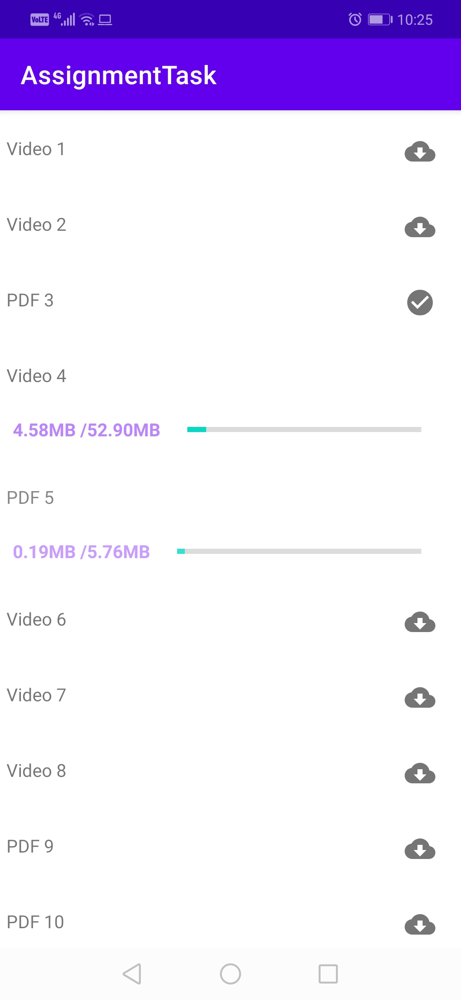

# AssignmentTask
# Usnig MVVM pattern to donload attachment 

I use service to download files in background but after search i found library do this solution perfect\
[(`RxDonload`]( https://github.com/ssseasonnn/RxDownload))

